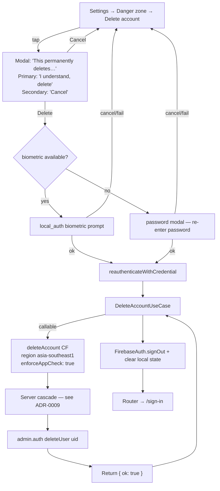

# Handoff Brief — Account Deletion (HB-004)

**WBS:** 2.4 (Account Deletion — UI + use case + Cloud Function server cascade)
**Sprint:** S5
**Day:** Day 2 (parallel with HB-003 5.5b)
**Target branch:** `feat/2.4-account-deletion`
**Owner:** flutter-engineer (Kraiwich), with security-reviewer pre-read Day 1 + audit Day 2 PM
**Related:** ADR-0009 (account-deletion topology — written alongside this brief); ADR-0003 (`enforceAppCheck` posture for callable CFs); CLAUDE.md "do-not-do list" (`firestore.rules`, `functions/src/*` require security-reviewer sign-off)

## Goal

Ship account deletion that satisfies the v1.5 privacy commitment: a user taps "Delete account" in Settings and within seconds every Firestore document, every Storage object, every FCM token, and the Firebase Auth record itself are irrecoverably gone. The delete must:

- Be **server-cascaded** via an admin-SDK Cloud Function — Firestore rules deny client-side deletes outside the same-day mutability window, so a client-driven delete cannot work without permanently relaxing rules. ADR-0009 makes this trade-off explicit.
- Be **idempotent** — re-running on a uid whose data is already gone returns `{ ok: true, alreadyDeleted: true }`. Crash-recovery friendly.
- Be **reauth-gated** — Firebase Auth requires the user to have signed in within ~5 minutes before `admin.auth().deleteUser(uid)` will accept the operation; the client reauthenticates immediately before invoking the CF.
- Use a **two-step destructive UI** — no typed-DELETE, just a confirm modal followed by reauth (per O12).

## Flow (canonical)



## Domain shape

### `DeleteAccountUseCase` (NEW)

**File:** `apps/mobile/lib/features/auth/domain/usecases/delete_account.dart`

```dart
import 'package:core/core.dart';

import '../auth_credentials.dart';
import '../auth_failure.dart';
import '../auth_repository.dart';

/// Composes the three-step deletion: reauth → call deleteAccount CF →
/// signOut. The repository owns the actual Firebase Auth + Cloud
/// Functions calls; this use case is the orchestration entry point that
/// the Settings controller invokes.
///
/// Reauth fence: Firebase Auth requires a recent sign-in (~5min) before
/// `delete()` will succeed. The use case calls `reauthenticate(...)`
/// first; if that fails, the CF is never invoked and the local user
/// remains signed in.
class DeleteAccountUseCase {
  const DeleteAccountUseCase(this._repo);
  final AuthRepository _repo;

  Future<Result<void, AuthFailure>> call({
    required AuthCredentials reauth,
  }) async {
    final reauthResult = await _repo.reauthenticate(reauth);
    if (reauthResult is Err<void, AuthFailure>) {
      return reauthResult;
    }
    final deleteResult = await _repo.deleteAccount();
    if (deleteResult is Err<void, AuthFailure>) {
      return deleteResult;
    }
    return _repo.signOut();
  }
}
```

### `AuthCredentials` (NEW, sealed)

**File:** `apps/mobile/lib/features/auth/domain/auth_credentials.dart`

```dart
/// Pure-Dart sealed credentials envelope. Implementations in `data/`
/// translate these to the corresponding Firebase Auth credential type
/// (EmailAuthProvider.credential, GoogleAuthProvider, etc.).
sealed class AuthCredentials {
  const AuthCredentials();
  const factory AuthCredentials.password({
    required String email,
    required String password,
  }) = PasswordCredentials;
  const factory AuthCredentials.google({required String idToken}) =
      GoogleCredentials;
  const factory AuthCredentials.biometric() = BiometricCredentials;
}

class PasswordCredentials extends AuthCredentials {
  const PasswordCredentials({required this.email, required this.password});
  final String email;
  final String password;
}

class GoogleCredentials extends AuthCredentials {
  const GoogleCredentials({required this.idToken});
  final String idToken;
}

/// Biometric reauth uses the platform keystore-cached credential — see
/// the Sprint 4 biometric setup. The data layer reads the cached
/// credential and converts it to a Firebase Auth credential at the
/// repository boundary.
class BiometricCredentials extends AuthCredentials {
  const BiometricCredentials();
}
```

### `AuthRepository` extension

**File:** `apps/mobile/lib/features/auth/domain/auth_repository.dart` (EDIT)

Add two methods to the abstract:

```dart
/// Reauthenticates the currently-signed-in user. Required by Firebase
/// Auth before `delete()` will accept the user. On success the
/// authenticated session has a fresh sign-in timestamp (within the
/// ~5min window required for sensitive operations).
Future<Result<void, AuthFailure>> reauthenticate(AuthCredentials creds);

/// Calls the `deleteAccount` Cloud Function (which performs the
/// server-cascade) and then deletes the Firebase Auth user record.
/// Idempotent: a re-run on an already-deleted uid returns `Ok(null)`
/// because the CF returns `{ ok: true, alreadyDeleted: true }` and the
/// local Auth user is already null.
Future<Result<void, AuthFailure>> deleteAccount();
```

`AuthFailure` already exists. **Do not** add new sealed variants for delete-specific failures — `AuthFailure.network()`, `AuthFailure.tooManyRequests()`, `AuthFailure.unknown(cause)` cover the new error surface.

## Data shape

`AuthRepositoryImpl.deleteAccount()` invokes the callable Cloud Function via the existing `cloud_functions` provider, then calls `FirebaseAuth.instance.currentUser?.delete()`. On `requires-recent-login` the impl maps to `AuthFailure.tooManyRequests()` (with the message overridden in the Settings copy to "Please sign in again before deleting your account."); the use case ensures reauth happens first, so this should be unreachable in the happy path.

`AuthRepositoryImpl.reauthenticate()` switches on the credentials variant and calls `currentUser.reauthenticateWithCredential(...)` with the appropriate Firebase Auth credential.

### `deleteAccount` Cloud Function — contract (canonical)

**File:** `functions/src/deleteAccount.ts` (NEW)

```ts
// Callable function: deleteAccount
// Region: 'asia-southeast1'
// Memory: '256MiB'
// Timeout: 540s (long enough for a fully-loaded user; recursiveDelete
//   on a 5,000-mood account costs ~30s; Storage list+delete with a few
//   thousand objects is a similar order of magnitude)
// enforceAppCheck: true

import { onCall, HttpsError } from 'firebase-functions/v2/https';
import { getFirestore } from 'firebase-admin/firestore';
import { getStorage } from 'firebase-admin/storage';
import { getAuth } from 'firebase-admin/auth';
import { logger } from 'firebase-functions';

interface DeleteAccountResponse {
  ok: true;
  alreadyDeleted: boolean;
  requestId: string;
  v: 1;
}

export const deleteAccount = onCall(
  {
    region: 'asia-southeast1',
    enforceAppCheck: true,
    memory: '256MiB',
    timeoutSeconds: 540,
  },
  async (request): Promise<DeleteAccountResponse> => {
    const uid = request.auth?.uid;
    if (!uid) {
      throw new HttpsError('unauthenticated', 'Sign in required.');
    }
    const requestId = (request.data?.requestId as string | undefined) ?? 'unknown';
    const startMs = Date.now();
    const db = getFirestore();
    const bucket = getStorage().bucket();

    // Idempotency probe — if the root user doc is already absent AND
    // the auth user is already gone, treat as already-deleted. We do
    // NOT short-circuit purely on the auth user check, because a prior
    // run could have crashed mid-cascade with the auth user still
    // present.
    const rootRef = db.doc(`users/${uid}`);
    const rootSnap = await rootRef.get();
    let authUserExists = true;
    try {
      await getAuth().getUser(uid);
    } catch (e) {
      authUserExists = false;
    }
    if (!rootSnap.exists && !authUserExists) {
      logger.info({
        event: 'deleteAccount',
        requestId,
        uid,
        outcome: 'already_deleted',
        latencyTotalMs: Date.now() - startMs,
      });
      return { ok: true, alreadyDeleted: true, requestId, v: 1 };
    }

    // Cascade order — children before parents, Storage before root,
    // Auth last (deleting the Auth user revokes the caller's token,
    // so any Firestore write after this point would fail with
    // permission-denied).
    //   1. users/{uid}/moods/**
    //   2. users/{uid}/insights/**
    //   3. users/{uid}/cheerUpEvents/**
    //   4. users/{uid}/fcmTokens/** (legacy path; v1.5 stores in
    //      users/{uid}/settings/notifications.tokens but the doc is
    //      caught by step 6 below)
    //   5. users/{uid}/interventionState/**
    //   6. users/{uid}/settings/**
    //   7. Storage prefix users/{uid}/media/
    //   8. users/{uid} root doc (recursiveDelete catches it but we run
    //      it explicitly for clarity; idempotent)
    //   9. admin.auth().deleteUser(uid)
    //  10. Per-uid rate-limit docs (rateLimits/{uid},
    //      rateLimits/cheerUp/{uid}, rateLimits.patterns/{uid}) — best
    //      effort, non-fatal if absent.

    // Steps 1-6 + 8: a single recursiveDelete on the user root walks
    // every sub-collection in one pass. Use the bulk writer with the
    // default rate limit; the server will throttle internally.
    await db.recursiveDelete(rootRef);

    // Step 7: Storage media. listFiles is paginated; deleteFiles({prefix})
    // handles the iteration internally.
    await bucket.deleteFiles({ prefix: `users/${uid}/media/` });

    // Step 9: Auth user. Catch user-not-found (race with a concurrent
    // delete or an admin-console manual delete).
    try {
      await getAuth().deleteUser(uid);
    } catch (e) {
      const code = (e as { code?: string }).code;
      if (code !== 'auth/user-not-found') {
        throw e;
      }
    }

    // Step 10: rate-limit docs — best effort
    await Promise.allSettled([
      db.doc(`rateLimits/${uid}`).delete(),
      db.doc(`rateLimits/cheerUp/${uid}`).delete(),
      db.doc(`rateLimits.patterns/${uid}`).delete(),
    ]);

    logger.info({
      event: 'deleteAccount',
      requestId,
      uid,
      outcome: 'deleted',
      latencyTotalMs: Date.now() - startMs,
    });

    return { ok: true, alreadyDeleted: false, requestId, v: 1 };
  },
);
```

**Logger allowlist:** `event, requestId, uid, outcome, latencyTotalMs, errorReason`. Forbidden: any field from any user document, any Storage object name, any token string. The PII canary test asserts no captured log contains a `mood` value, a `text` value, or a Storage object path beyond the `users/{uid}/media/` prefix.

**Index export:** `functions/src/index.ts` — add `export { deleteAccount } from './deleteAccount.js';`.

### Reauth window note

Firebase Auth's `delete()` and `reauthenticateWithCredential()` are connected: the auth user must have signed in within ~5 minutes before `delete()` will accept the operation, regardless of how recently the ID token was minted. The client therefore MUST call `reauthenticateWithCredential` immediately before invoking the CF — not just when the user opens the screen.

Concretely, the order in `AuthRepositoryImpl.deleteAccount()` is:

1. (controller) prompt for credential, build `AuthCredentials`
2. (controller) call `useCase.call(reauth: creds)` which does:
   1. `repo.reauthenticate(creds)` → Firebase Auth `currentUser.reauthenticateWithCredential(...)`
   2. on success → `repo.deleteAccount()` → callable CF → on success → `currentUser.delete()`
   3. on success → `repo.signOut()` → router redirects to `/sign-in`

If the user pauses between step 1 and step 2 longer than ~5 minutes, the CF still succeeds (it uses the admin SDK, not the user's session) but the local `currentUser.delete()` may fail with `requires-recent-login`. The CF has already deleted everything, so the impl catches that exception and proceeds with `signOut()` regardless — the user's local session is the only thing the recent-login window guards against, and the data is already gone. Document this in code comments and in the security-reviewer audit checklist.

## Presentation shape

### Settings UI — Danger zone

`apps/mobile/lib/features/settings/presentation/settings_screen.dart` — add a new `MbCard` zone titled "Danger zone" beneath the Account zone (insertion point: after line 116 per Sprint-5 plan §5). Single tappable row:

```
ListTile(
  leading: Icon(Icons.delete_forever, color: theme.colorScheme.error),
  title: Text('Delete account', style: TextStyle(color: theme.colorScheme.error)),
  subtitle: Text('This cannot be undone.'),
  onTap: () => _confirmDeleteAccount(context, ref),
)
```

`_confirmDeleteAccount` opens an `AlertDialog`:

- **Title:** `Delete your account?`
- **Body:** `"This permanently deletes your account, all entries, and photos. This cannot be undone."` (verbatim per O12)
- **Primary destructive button:** `"I understand, delete"` — colour `theme.colorScheme.error`, `FilledButton`, full width
- **Secondary button:** `"Cancel"` — text button, dismisses the modal

On primary tap:

1. Probe biometric availability via the existing `local_auth` provider. If biometric is enrolled, prompt and on success build `AuthCredentials.biometric()`. If biometric is not available or the user dismisses, fall back to a password modal that asks the user to re-enter their password (email is pulled from the `currentUser.email`).
2. Show a blocking `CircularProgressIndicator` modal while the use case runs.
3. On `Ok`, the auth-state stream emits `null`; the router redirects to `/sign-in`. Pop nothing manually — let the router handle it.
4. On `Err(AuthFailure.wrongPassword())`, show inline error in the password modal.
5. On `Err(AuthFailure.network())`, show a `SnackBar`: `"We couldn't reach the server. Please try again."`.
6. On any other `Err`, show a `SnackBar`: `"Something went wrong. Please try again."`.

**No typed-DELETE step.** Reauth is the security gate, not a typed phrase.

### Files touched (presentation)

- EDIT `apps/mobile/lib/features/settings/presentation/settings_screen.dart` (Danger zone, modal, reauth flow)
- NEW `apps/mobile/lib/features/settings/presentation/widgets/delete_account_modal.dart` (the `AlertDialog`)
- NEW `apps/mobile/lib/features/settings/presentation/controllers/delete_account_controller.dart` (`@riverpod` controller orchestrating biometric → password fallback → use case)

## File index (NEW + EDIT)

**NEW (server):**
- `functions/src/deleteAccount.ts`
- `functions/src/__tests__/deleteAccount.test.ts`

**NEW (client):**
- `apps/mobile/lib/features/auth/domain/auth_credentials.dart`
- `apps/mobile/lib/features/auth/domain/usecases/delete_account.dart`
- `apps/mobile/lib/features/settings/presentation/widgets/delete_account_modal.dart`
- `apps/mobile/lib/features/settings/presentation/controllers/delete_account_controller.dart`

**NEW (tests):**
- `apps/mobile/test/features/auth/domain/usecases/delete_account_test.dart`
- `apps/mobile/test/features/settings/presentation/delete_account_modal_test.dart`
- `functions/src/__tests__/deleteAccount.test.ts`
- `firebase/test/account-deletion-emulator.spec.ts` (NEW E2E)

**EDIT:**
- `apps/mobile/lib/features/auth/domain/auth_repository.dart` (add `reauthenticate`, `deleteAccount`)
- `apps/mobile/lib/features/auth/data/auth_repository_impl.dart` (implement both)
- `apps/mobile/lib/features/auth/data/providers.dart` (expose `deleteAccountUseCaseProvider`)
- `apps/mobile/lib/features/settings/presentation/settings_screen.dart` (Danger zone insertion)
- `functions/src/index.ts` (export)

## Tests to write

### Unit — `delete_account_test.dart`

1. **happy path** — fake repo `reauthenticate` Ok, `deleteAccount` Ok, `signOut` Ok → use case returns `Ok(null)`; verify call ordering.
2. **reauth fails** — `reauthenticate` returns `Err(wrongPassword)` → use case short-circuits; `deleteAccount` is NOT called; `signOut` is NOT called.
3. **CF fails** — `reauthenticate` Ok, `deleteAccount` returns `Err(network)` → use case returns the network error; `signOut` is NOT called (user is still signed in, can retry).
4. **signOut fails post-delete** — `deleteAccount` Ok, `signOut` returns `Err(unknown)` → use case returns the signOut error; the data is gone but the local session is stuck. Acceptable degraded state.

### Widget — `delete_account_modal_test.dart`

5. **modal copy** — `find.text("This permanently deletes your account, all entries, and photos. This cannot be undone.")` finds one widget; `find.text("I understand, delete")` finds one widget.
6. **destructive button colour** — the primary button uses `theme.colorScheme.error` foreground.
7. **cancel does nothing** — tap "Cancel"; controller is never invoked.

### Server — `deleteAccount.test.ts`

8. **auth missing** — no `request.auth?.uid` → throws `HttpsError('unauthenticated')`.
9. **happy path** — seed Firestore with `users/{uid}`, `users/{uid}/moods/{x}`, `users/{uid}/settings/notifications`, `users/{uid}/cheerUpEvents/2026-05-13-5_of_7_negative`, Storage `users/{uid}/media/x.jpg`, Auth user present → CF returns `{ ok: true, alreadyDeleted: false }`; assert all paths are gone post-call; assert `getAuth().getUser(uid)` throws `auth/user-not-found`.
10. **idempotent re-run** — call CF twice in succession on the same uid → second call returns `{ ok: true, alreadyDeleted: true }`; no exception.
11. **partial-state recovery** — pre-delete the Auth user only (simulate prior crash), keep Firestore + Storage intact, call CF → CF deletes Firestore + Storage, catches `auth/user-not-found`, returns `{ ok: true, alreadyDeleted: false }`.
12. **PII canary** — across all cases, capture logger calls; assert no payload contains a `mood` value, a `text` value, or a Storage object name beyond `users/{uid}/media/`.

### E2E — `firebase/test/account-deletion-emulator.spec.ts`

13. **full emulator E2E** — bring up Firestore + Auth + Storage emulators; create a real Auth user (`createUserWithEmailAndPassword`); seed `users/{uid}`, three mood docs, one insights doc, one cheerUpEvents doc, one settings/notifications doc with two tokens, three Storage objects under `users/{uid}/media/`, three rate-limit docs; call the deployed CF (via `httpsCallable`); assert: every Firestore prefix under `users/{uid}` returns empty; `bucket.getFiles({prefix: 'users/${uid}/media/'})` returns empty; `getAuth().getUser(uid)` throws; all three rate-limit docs are gone.

Coverage target: ≥90% on `deleteAccount.ts`.

## Security-reviewer pre-read checklist (Day 1)

The pre-read happens before flutter-engineer opens the PR so blockers surface early. Reviewer reads ADR-0009 + this brief + the existing `analyzeMoodText.ts` security audit and confirms:

- [ ] **Server cascade is the only path** — no client-side `WriteBatch` or `recursiveDelete` is being added; rules remain as-is for the same-day mutability gate.
- [ ] **`enforceAppCheck: true`** — present on the CF; aligns with `analyzePatterns.ts` posture.
- [ ] **Region pinning** — `asia-southeast1` matches the rest of the project.
- [ ] **Reauth fence** — the use case calls `reauthenticate` before the CF; the impl catches `requires-recent-login` from the local `currentUser.delete()` and proceeds anyway because the data is gone server-side.
- [ ] **Idempotency** — re-running on a deleted uid returns `{ ok: true, alreadyDeleted: true }` without exception; the partial-state path is covered.
- [ ] **Logger allowlist** — `uid` is logged (not PII per ADR-0003); no mood data, no Storage paths beyond the prefix, no tokens.
- [ ] **Storage cascade** — `bucket.deleteFiles({prefix: 'users/${uid}/media/'})` is called; no other Storage prefix is touched (a future profile photo at `users/{uid}/profile.jpg` is NOT yet implemented; if it lands in S5, the CF must be re-audited).
- [ ] **Rate-limit doc cleanup** — best-effort `Promise.allSettled` on the three known rate-limit doc paths; non-fatal if absent.
- [ ] **No PII in client logs** — `delete_account_controller.dart` logs `uid` and `outcome` only; never the mood text, never the Storage paths.

## Acceptance criteria

The feature is complete when:

- [ ] `cd functions && pnpm test` — all 5 server cases green; ≥90% coverage on `deleteAccount.ts`; PII canary passes.
- [ ] `cd apps/mobile && flutter test` — use-case unit tests green; widget tests green; existing suite still green.
- [ ] `firebase/test/account-deletion-emulator.spec.ts` — green against `firebase emulators:exec`.
- [ ] Manual: sign in as a seeded user; Settings → Delete account → confirm modal → biometric or password reauth → spinner → app routes to `/sign-in`; Firebase Console shows `users/{uid}` and `users/{uid}/media/**` are gone, Auth user removed; sign-in attempt with the same email returns "user not found".
- [ ] No log payload contains the mood text, Storage paths beyond the user prefix, or any FCM token string.
- [ ] Modal copy matches verbatim per O12 (the security-reviewer reviews the rendered string).
- [ ] No typed-DELETE step in the UI; reauth is the only gate.
- [ ] Non-author approver merges (Enterprise R3).

## Out of scope on this brief

- A 30-day "soft delete" / undo window. The decision is hard-delete now; revisit in v1.6 if user research surfaces regret-cases.
- Account export / data download before delete. Out of scope for v1.5; flag as v1.6 for GDPR-style portability.
- Admin console for support staff to delete a user on the user's behalf. Not a v1.5 feature.
- Per-feature opt-out (delete only mood history but keep account). Not a v1.5 feature.
