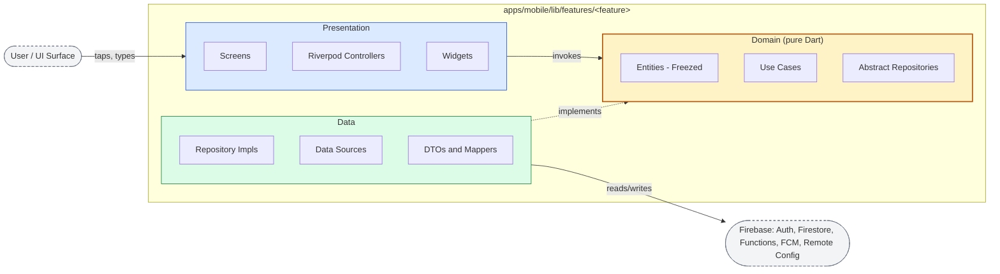

# MoodBloom — Conceptual Architecture

MoodBloom follows strict Clean Architecture with three concentric layers per feature module. The dependency rule is one-way and absolute: outer layers depend on inner layers; inner layers know nothing of outer layers. The **domain** layer at the center contains business rules, entities, use cases, and abstract repository interfaces — pure Dart, no `package:flutter/*`, no `package:firebase_*/*`, no `package:cloud_firestore/*`. This is "the one rule that cannot break" from `CLAUDE.md` and is enforced at write-time by the `domain-layer-purity` hook in `.claude/hooks/settings.json`.

Seven feature modules live under `apps/mobile/lib/features/`: `auth/`, `mood/`, `garden/`, `analytics/`, `history/`, `settings/`, `onboarding/`. Each is self-contained with its own `presentation/`, `domain/`, `data/` triad. Cross-cutting concerns (error types, `Result<T, Failure>`, structured logger, design tokens, chart wrappers) live in `packages/core/`, `packages/design_system/`, and `packages/analytics/` so they can be reused without coupling features to one another.

**Reading the arrows:** Solid arrows are runtime calls. The dotted `Data -.-> Domain` arrow is the Dependency Inversion edge: data layer depends on domain abstractions, never the reverse. Riverpod `provider overrides` swap concrete implementations for fakes in tests, which is only possible because the seam is an abstract interface in `domain/`.

**Test consequence:** because `domain/` imports nothing platform-specific, every use case and entity is unit-testable on the Dart VM with no Flutter test harness, no Firestore emulator, and no widget tree. This is what makes the ≥80% domain coverage gate (CLAUDE.md Quality Gate 1) practical.
