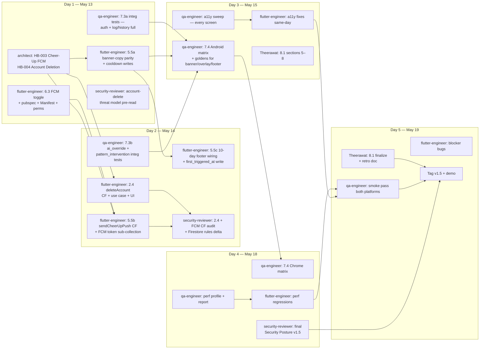
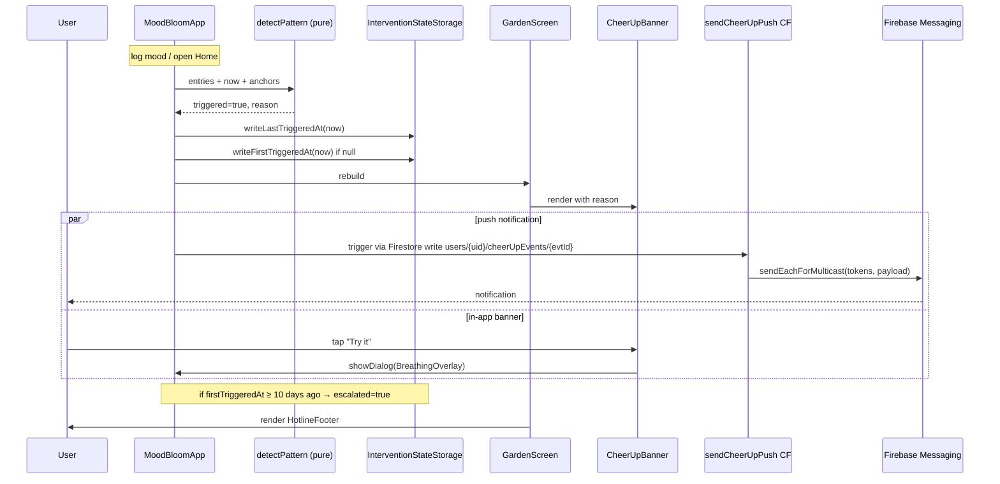
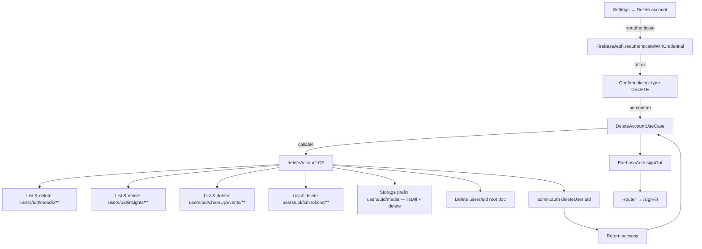

# Sprint 5 Refined Plan — v1.5 Cheer-Up + Cross-Platform QA + Final Release

**Status:** Approved via Ultraplan remote session 2026-05-06.
**Sprint window:** May 13 – May 19, 2026 (5 working days). Demo + tag `v1.5` end of day 5.
**Critical path:** U (Integration Tests, 2.0d) → X (Cross-Platform QA + a11y + Perf, 2.0d) → Y (Finalize Reports, 1.0d). 0.5-day buffer; treat every day as load-bearing.

This plan supersedes the prior local-orchestrator draft. Decision log for the 11 user-facing open questions resolved during local clarification (O1, O2, O3, O5, O6, O7, O8, O10, O11, O12, O13) is preserved in conversation history; the resolutions are baked into the sections below.

---

## 1. Context

Sprint 4 tagged `v1.0` at `d1eaa1df` (retroactive tag to be pushed Day-1 morning) and shipped: pattern detector + cooldown/escalation entity + provider; cheer-up banner widget, breathing overlay widget, hotline footer widget (rendered in `garden_screen.dart` but **not yet writing persistence**); Insights card with confidence labels; rollback rehearsal evidence; dark mode. The S4 detector "fires a state update but does not yet surface any action beyond a session-scoped banner": no FCM, no cooldown writes, no escalation anchor writes, no banner copy parity with the locked CLAUDE.md form.

Sprint 5 makes the safety net real: **wire the cheer-up loop end-to-end** (UI → cooldown writes → escalation anchor → FCM push → 10-day footer), **ship account deletion**, **add the FCM permission/toggle path**, **complete the integration test matrix on both Android and Chrome**, **run a11y + perf sweeps**, **finalize the Enterprise Audit Report**, and **assemble the May-30 evidence package**. The QA agent is the bottleneck — every other track must keep flutter-engineer's PRs green and reviewable so qa-engineer is never blocked.

---

## 2. Dispatch graph (per-agent, day-by-day)



Reading the graph: vertical lanes are agents; arrows are work-product dependencies. Every dispatch a row down must be able to read the artifact produced by the row above. The two architect briefs (HB-003, HB-004) gate Day 1 of flutter-engineer's two main tracks. security-reviewer's pre-read on Day 1 pre-empts the Day 2 audit so deletion blockers surface before the code is written, not after.

---

## 3. Day-1 sequencing — S4 carry-over closures vs S5 build tracks

### Day 1 morning — single PR `chore/s5-day1-carryover` (≤ 2h)

Bundled because each item is < 30 min and they share the build/CI surface:

| Carry-over | File(s) | Acceptance |
|---|---|---|
| AndroidManifest biometric perm | `apps/mobile/android/app/src/main/AndroidManifest.xml` — add `<uses-permission android:name="android.permission.USE_BIOMETRIC"/>` (and legacy `USE_FINGERPRINT` for API < 28) | `flutter run -d android` opens biometric prompt without `PlatformException(no_fragment_activity)` |
| AndroidManifest FCM perms | same file — add `<uses-permission android:name="android.permission.POST_NOTIFICATIONS"/>` (Android 13+), `<meta-data android:name="com.google.firebase.messaging.default_notification_icon" .../>`, `<meta-data ... default_notification_color .../>`, default channel id meta-data | Manifest merger succeeds; channel id matches the one used in `sendCheerUpPush` payload |
| Drift hardening verification | run `cd apps/mobile && flutter test test/features/mood/data/local/` and `test/features/mood/data/sync/` | All Drift + sync tests still green at v1.0 head; record count in retro |
| gh CLI in CI | `.github/workflows/ci.yml` — add `gh auth status` smoke step (already on `ubuntu-latest`, gh pre-installed) and use `gh pr comment` from the test-coverage job to post coverage diff | First S5 PR sees a coverage comment from the bot |
| Missing goldens scaffold | create empty `apps/mobile/test/features/garden/presentation/widgets/goldens/` and `.gitkeep` so qa-engineer's Day 3 `--update-goldens` writes into a tracked dir | `git status` clean after first golden gen |
| v1.0 retroactive tag | `git tag -a v1.0 d1eaa1df -m "MoodBloom v1.0 — S4 release (post-audit, post-v1.0.1 hardening)"` + push | `git tag -l v1.0` non-empty |

This bundle ships before the architect's briefs land (parallel work, no shared files). If any item slips, only it slips — the morning closure is independently mergeable.

### Day 1 afternoon — three parallel tracks

1. **architect** writes HB-003 (cheer-up FCM, full state machine + payload spec) and HB-004 (account deletion, server-cascade contract).
2. **flutter-engineer** starts WBS 6.3 (lowest risk, no design dependency): pubspec → Manifest perm (already merged in morning bundle) → `FcmTokenRepository` + `users/{uid}/fcmTokens/{tokenId}` Firestore writes → settings tile + permission request flow.
3. **qa-engineer** begins 7.3a — implements the auth and mood-log/history integration tests that already have stubs (`auth_flow_test.dart` is partially real; `mood_log_history_flow_test.dart` is empty stub). These do not block on S5 features and unblock Day 2 work.

---

## 4. WBS 5.5 — Cheer-Up Intervention (most-detailed track)

The S4 widgets exist but the loop is open. Day 1+2 closes it.

### 4.1 What's already in `main` (S4)

| File | Status |
|---|---|
| `apps/mobile/lib/features/garden/domain/pattern_detector.dart` | ✅ pure-Dart rules + cooldown + escalation gates |
| `apps/mobile/lib/features/garden/domain/entities/intervention_state.dart` | ✅ Freezed entity |
| `apps/mobile/lib/features/garden/data/intervention_state_storage.dart` | ✅ SharedPreferences read/write/clearFirst/maybeClearFirst |
| `apps/mobile/lib/features/garden/data/providers.dart` — `interventionStateProvider` | ✅ reads anchors, runs detector |
| `apps/mobile/lib/features/garden/presentation/widgets/cheer_up_banner.dart` | ⚠️ renders + opens overlay; **does not write cooldown**; copy is split across two `Text` widgets |
| `apps/mobile/lib/features/garden/presentation/widgets/breathing_overlay.dart` | ✅ 4-7-8 timer + UI |
| `apps/mobile/lib/features/garden/presentation/widgets/hotline_footer.dart` | ✅ copy-locked footer |
| `apps/mobile/lib/features/garden/presentation/garden_screen.dart` | ⚠️ shows banner when `triggered && !bannerDismissed`; never writes anchors; never schedules push |
| `firebase_messaging` Dart pkg / `messaging` Admin trigger | ❌ not present |

### 4.2 What S5 must add



### 4.3 5.5a — Copy parity + cooldown writes (Day 1, flutter-engineer)

- Banner copy is locked: `"It's been a heavy week. Want to try a two-minute breathing exercise?"` — **one logical sentence**. Current widget splits into title + body across two `Text`s. Acceptable visually, but the `Semantics(label: ...)` on `cheer_up_banner.dart:50` already concatenates correctly. **Decision: keep the visual two-line layout; add a widget test that asserts the concatenated `Semantics` label exactly equals the locked string** (so screen readers + grading rubric both see the locked sentence).
- Add a `cheerUpControllerProvider` in `apps/mobile/lib/features/garden/presentation/controllers/cheer_up_controller.dart`:
  - `void onShown()` → calls `storage.writeLastTriggeredAt(now)` AND `storage.writeFirstTriggeredAt(now)` only if `readFirstTriggeredAt() == null`. Idempotent per app launch (track a session bool in the controller).
  - `void onDismissed()` → calls `onShown()` semantics + sets the session-dismissed flag. The cooldown is the persistence; the session flag is the ephemeral hide.
- Garden screen wires `ref.read(cheerUpControllerProvider.notifier).onShown()` from a `useEffect`/`addPostFrameCallback` when `triggered` first becomes true in this lifecycle.
- The `_bannerDismissed` ad-hoc bool in `_GardenScreenState` (line 44) moves into the controller so it survives a `setState` in the parent.

**Files touched:**
- NEW `apps/mobile/lib/features/garden/presentation/controllers/cheer_up_controller.dart`
- EDIT `apps/mobile/lib/features/garden/presentation/garden_screen.dart` (lines 44, 87–89, 163–170)
- EDIT `apps/mobile/lib/features/garden/data/providers.dart` (no API change; ensure the controller can read the resolved storage)

### 4.4 5.5b — `sendCheerUpPush` Cloud Function + FCM token registry (Day 2, flutter-engineer + security-reviewer)

- pubspec: add `firebase_messaging: ^15.x` (use latest compatible with `firebase_core: ^4.3.0`).
- `apps/mobile/lib/features/notifications/` (new feature folder, presentation + data + domain triad):
  - domain `FcmTokenRepository` abstract.
  - data `FcmTokenRepositoryImpl`: on sign-in `getToken()` and on `onTokenRefresh` → upsert to `users/{uid}/fcmTokens/{tokenId}` with `{token, platform, createdAt}`.
  - presentation: a `notificationsBootstrapper` consumed in `app/router.dart` `ref.listen(currentUserStreamProvider)` so token registration happens on first authenticated frame.
- Cloud Function `functions/src/sendCheerUpPush.ts`:
  - **Trigger**: `onDocumentCreated('users/{uid}/cheerUpEvents/{evtId}', ...)` — the client writes a small event doc when the banner first appears in this lifecycle (idempotent — same doc id `${dayUtc}-${reason}` so duplicate writes within a day collapse).
  - **Payload (no PII)**: `{ notification: { title: "A gentle check-in", body: "Noticing you've had a rough stretch. We're here." }, android: { notification: { channelId: 'cheer_up' } } }`. Body is a constant. Never includes mood text.
  - **Logger allowlist**: `event, requestId, uid, outcome, tokenCount, deliveredCount, failedCount`. Never log token strings or body.
  - **Rate limit**: re-use `consumeToken({ docPath: 'rateLimits/cheerUp/{uid}', windowMs: 86_400_000, max: 1 })` — at most one push per uid per 24h regardless of detector flutter.
- Firestore rules: add `users/{uid}/cheerUpEvents/{evtId}` — `create: isOwner && event-id matches /^\d{4}-\d{2}-\d{2}-(5_of_7_negative|3_consecutive_high_intensity)$/ && createdAt == request.time`; `read: isOwner`; `update, delete: false`. Add `users/{uid}/fcmTokens/{tokenId}` — `read, write: isOwner` plus a token-shape check.
- Functions test: clone `analyzePatterns.test.ts` shape; assert idempotent doc id, no PII in logs, rate limit honoured, multicast call uses every active token.

**Architect-approved waiver needed**: editing `firestore.rules` and adding a CF trigger — security-reviewer audit gates merge.

### 4.5 5.5c — 10-day escalation footer + first-trigger anchor (Day 2, flutter-engineer)

The detector already writes `escalated: true` when `firstTriggeredAt + 10d ≤ now` (`pattern_detector.dart:103-110`) AND `garden_screen.dart:203-207` already conditionally renders `HotlineFooter`. Closure work is just making sure `firstTriggeredAt` is populated, which 5.5a already covers — so 5.5c is a verification pass + a widget test that pumps `firstTriggeredAt = now - 11d` and asserts the footer renders.

---

## 5. WBS 2.4 — Account Deletion



- Use case: `apps/mobile/lib/features/auth/domain/usecases/delete_account.dart` — `Future<Result<void, AuthFailure>> call({required AuthCredentials reauth})`.
- Repository extension: add `deleteAccount` to abstract `AuthRepository`; implement in `AuthRepositoryImpl` to (a) `reauthenticateWithCredential`, (b) call CF, (c) `signOut` after CF success.
- Cloud Function `functions/src/deleteAccount.ts` — onCall, `enforceAppCheck: true`, region `asia-southeast1`. Server-side cascade because rules deny client-side deletes outside the same-day window — bypassing them via admin SDK is the only correct path. Use 100-doc batches and recurse subcollections via `db.recursiveDelete()`.
- Settings UI: add a destructive `MbCard` zone "Danger zone" beneath the Account zone (`apps/mobile/lib/features/settings/presentation/settings_screen.dart` after line 116). Two-step (per O12): tap "Delete account" → modal "I understand, delete" + Cancel → biometric reauth (if `local_auth` available) else password modal → CF → auth.delete → /sign-in. **No typed-DELETE step**; reauth is the security gate.
- security-reviewer audit (Day 2): no orphaned Storage objects, no surviving Firestore docs (run a Day-3 manual verification against an emulator-seeded uid), Auth record genuinely deleted, no PII in CF logs, reauth required on all paths (no shortcuts via stale token).

**Files touched:**
- NEW `functions/src/deleteAccount.ts`, `functions/src/__tests__/deleteAccount.test.ts`
- EDIT `functions/src/index.ts` to export
- NEW `apps/mobile/lib/features/auth/domain/usecases/delete_account.dart`
- EDIT `apps/mobile/lib/features/auth/domain/auth_repository.dart`, `apps/mobile/lib/features/auth/data/auth_repository_impl.dart`
- EDIT `apps/mobile/lib/features/settings/presentation/settings_screen.dart`
- NEW widget tests + a use-case unit test

---

## 6. WBS 6.3 — FCM Toggle + Permission Request

- Settings tile under PREFERENCES in `apps/mobile/lib/features/settings/presentation/settings_screen.dart:88-91` (insert before the Security zone). Switch state: `notificationsEnabledProvider` backed by SharedPreferences key `notifications.cheer_up_enabled` (default `true` per O13).
- Permission flow on first toggle-on (or first sign-in if default-on hasn't been requested yet): `FirebaseMessaging.instance.requestPermission(alert: true, badge: true, sound: true)`. Web uses the browser permission API directly; Android 13+ goes through `POST_NOTIFICATIONS`.
- The flag gates **registration** (don't write a token doc if disabled) AND **the CF trigger** (CF reads `users/{uid}` `notifications.cheerUpEnabled` and short-circuits `outcome: 'opted_out'`).
- Firestore doc `users/{uid}/settings/notifications` shape (per O11): `{ enabled: bool, tokens: [{ token: string, platform: 'android'|'web', updatedAt: timestamp }] }`. CF iterates `tokens[]` for multi-device push.

---

## 7. WBS 7.3 — Integration Tests

The four files under `apps/mobile/integration_test/` exist; only `auth_flow_test.dart` has a real implementation. The others are stubs.

| Test | File | What lands |
|---|---|---|
| Auth | `auth_flow_test.dart` | already real — verify still passes |
| Mood log → history | `mood_log_history_flow_test.dart` | pump harness, sign in, log sad@3, navigate to /history, tap entry, assert detail screen renders |
| AI override | `ai_override_flow_test.dart` | open /log-mood, type, wait for suggestion pill, tap a different mood, save, assert persisted entry uses user's pick |
| Pattern intervention | `pattern_intervention_stub_test.dart` (rename to `pattern_intervention_flow_test.dart`) | seed 5 distinct negative days into a fake repo, pump harness, sign in, navigate to /home, assert banner renders, tap "Try it", assert breathing overlay; assert SharedPreferences key `intervention.last_triggered_at_iso8601` is non-null |

Each test must run on Android emulator AND `flutter test integration_test/<file>.dart -d chrome`. Web parity is part of acceptance.

---

## 8. WBS 7.4 — Cross-Platform QA + a11y + Performance

| Output | Path |
|---|---|
| Android matrix | `docs/qa/android-matrix-20260515.md` |
| Chrome matrix | `docs/qa/web-matrix-20260518.md` |
| a11y sweep | `docs/qa/a11y-sweep-20260515.md` |
| Performance profile | `docs/qa/perf-20260518.md` |
| Goldens for new widgets | `apps/mobile/test/features/garden/presentation/widgets/goldens/cheer_up_banner_*.png`, `breathing_overlay_*.png`, `hotline_footer_*.png` (light + dark) |

Acceptance bars (per kickoff): cold start < 2s mid-range Android; no frame > 16ms on analytics scroll; memory < 150MB on 200-entry history. Document raw timeline JSON paths, not just numbers — the audit report cites them.

a11y has a known risk: the cheer-up banner foreground `_fg = Color(0xFF5A3A2E)` against the coral→amber gradient. qa-engineer must run `flutter_a11y` colour-contrast or the WCAG 2.2 AA arithmetic check on every (fg, bg) pair on banner + breathing overlay. If any pair is below 4.5:1, escalate to design tokens — adjust `_fg` to a darker token rather than the gradient.

S4 acceptance gap: goldens missing for empty garden, flower garden, wilting-plant garden, analytics dashboard. qa-engineer Day 3 adds these alongside banner/overlay/footer.

---

## 9. WBS 8.1 — Enterprise Audit Report

Existing scaffolding: `docs/security/audit-2026-05-12-v1.0.md` (security posture) and `docs/retros/sprint-3-retro.md`. The Enterprise Audit Report aggregates these.

Path: `docs/audit/enterprise-audit-report.md` (per O5). Sections:

1. Executive summary (1 page)
2. Stack + architecture (refs `docs/architecture/conceptual.md`, `implementation.md`)
3. Security posture (refs `docs/security/audit-*.md`)
4. Quality gates (refs CI runs, coverage report, golden file count)
5. **Multi-agent orchestration workflow** — agent profiles in `.claude/agents/`, dispatch graph (this plan's §2 reused as evidence), handoff briefs in `.claude/briefs/`
6. **Agent challenges + mitigations** — what subagents missed (per retros) and how the orchestrator caught it
7. **Worked handoff example** — full HB-003 + the resulting PR diff + the qa-engineer review
8. **Plan Mode transcripts** — the S5 plan-mode session transcript exported as `docs/audit/transcripts/plan-mode-s5.md`

Fallback ownership (per kickoff §5): Kraiwich writes section 3 (Security Matrix), Jedsarit writes section 4 (Observability + Rollback) if Theerawat slips. Pre-decided here so day 5 has no scramble.

---

## 10. WBS 8.2 — Course Reports + Evidence Package (post-sprint)

May 30 deadline. Layout:

```
docs/submission/
├── README.md                              ← entry point graders read first
├── csc231-project-report.pdf              ← due May 26
├── csc234-uxui-report.pdf                 ← due May 28
├── enterprise-audit-report.pdf            ← export of docs/audit/enterprise-audit-report.md
├── slides/
│   ├── sprint-5-demo-slides.pdf
│   └── final-presentation.pdf
├── evidence/
│   ├── repo-link.txt                      ← https://github.com/<org>/moodbloom @ tag v1.5
│   ├── ci-runs/
│   │   ├── flutter-job.html               ← gh run view <id> --log
│   │   ├── firestore-rules-job.html
│   │   └── functions-job.html
│   ├── coverage/
│   │   ├── lcov-summary.txt               ← from flutter test --coverage
│   │   └── domain-coverage.txt            ← tool/check_domain_coverage.dart
│   ├── crashlytics/
│   │   └── dashboard-2026-05-19.png       ← screenshot
│   ├── goldens/                           ← copy of every PNG in test/**/goldens/
│   ├── qa/
│   │   ├── android-matrix-20260515.pdf
│   │   ├── web-matrix-20260518.pdf
│   │   ├── a11y-sweep-20260515.pdf
│   │   └── perf-20260518.pdf
│   ├── security/
│   │   ├── audit-2026-05-19-v1.5.pdf
│   │   └── npm-audit.txt
│   └── transcripts/
│       ├── plan-mode-s2.md … plan-mode-s5.md
│       └── handoff-briefs/                ← copy of .claude/briefs/sprint-{2..5}/*.md
└── submission-checklist.md                ← signed-off list with Theerawat's tick per item
```

Build via a Day 5 evening script `tool/package_evidence.sh` (new, ≈ 40 lines) that copies, runs `gh run view`, and zips `docs/submission/`. Tested once on Day 4 evening with a dry run.

---

## 11. Risk register (refined)

| # | Risk | Likelihood | Impact | Owner | Mitigation | Trigger |
|---|---|---|---|---|---|---|
| 1 | Cheer-up banner copy diverges from CLAUDE.md lock | M | H (grading rubric) | flutter-engineer | Widget test asserts exact `Semantics` label string; PR review by qa-engineer | Test red |
| 2 | FCM not delivered on Web (browser perm denied) | M | M | flutter-engineer | Web fallback: in-app banner is the source of truth; FCM is additive. Document in audit | Day 4 web matrix run |
| 3 | Hotline 1323 footer fires too early (anchor bug) | L | H (duty of care) | security-reviewer | Day-2 audit explicitly seeds anchor at now-11d, now-9d, now-10d-1s and asserts toggle | Audit checklist |
| 4 | Account deletion leaves orphaned Storage media | M | H (privacy law) | security-reviewer | CF uses `bucket.deleteFiles({prefix: 'users/${uid}/media/'})`; Day-3 manual verification on emulator-seeded uid | Verification step |
| 5 | a11y contrast fails on coral→amber banner | M | M | qa-engineer | Day-3 sweep; if fail, swap `_fg` to a darker design-system token; re-run goldens | Sweep doc |
| 6 | Drift migrations regressed by S4 changes | L | H | qa-engineer | Day-1 morning re-run of `test/features/mood/data/local/` — green before any S5 PR merges | Test count drop |
| 7 | Theerawat slips on report writing | M | H | orchestrator | Pre-decided fallback in §9 (Kraiwich + Jedsarit ghost-write specific sections) | EOD May 17 check-in |
| 8 | `gh` CLI auth fails in CI | L | L | flutter-engineer | Use `${{ secrets.GITHUB_TOKEN }}` (default), keep step `continue-on-error: true` for the coverage comment | CI red on first run |
| 9 | Critical-path slip eats 0.5d buffer | M | H | orchestrator | Day-2 EOD checkpoint: if 5.5b incomplete, drop the FCM rate-limit refinement to v1.6, ship MVP push | Checkpoint |
| 10 | Goldens unstable on web (font shaping diff) | M | M | qa-engineer | Use `flutter_test_config.dart` to pin `goldenFileComparator` to `LocalFileComparator` and run goldens **only on Linux CI**, not Chrome | First Chrome test run |
| 11 | `users/{uid}/cheerUpEvents/` doc-id collision under retry | L | M | flutter-engineer | Idempotent id `${dayUtc}-${reason}` plus `if-not-exists` semantics via `transaction.create` | Functions test #N |
| 12 | `firebase_messaging` v15+ requires Firebase BoM bump on Android | L | M | flutter-engineer | Run `flutter run -d android` in morning Day 1 after pubspec edit; if Gradle barfs, pin to last-good version per FlutterFire matrix | First Android build |

---

## 12. S4 acceptance gaps the local plan missed

| Gap | Evidence | Action in S5 |
|---|---|---|
| `MbCard` and other widget renders untested at Web breakpoint | only 3 golden files in `test/**/goldens/`; Settings, RainCloud, PatternInsightCard | qa-engineer Day 3 adds banner / overlay / footer goldens at 360, 800, 1280 widths (light + dark) |
| `pattern_intervention_stub_test.dart` reachable but not seeding the storage anchors | Day 4-S5 test runs the detector with `null` anchors | New harness helper `seedInterventionAnchors(prefs, lastTriggeredAt: …)` in `integration_test/app_harness.dart` |
| AndroidManifest ships zero notification meta-data even though the breathing overlay is reachable from a future push | Manifest at `apps/mobile/android/app/src/main/AndroidManifest.xml` has only `<queries>` block | Day-1 morning bundle adds default channel + icon + colour |
| `firebase_options.dart` strip not yet captured in an ADR | CLAUDE.md "Do-not-do list" mentions ADR-0002 as future; never written | Out of scope for S5 release; capture as v1.6 follow-up to keep scope tight |
| Coverage ≥ 80% domain not re-verified post-pattern-detector add | tool exists at `apps/mobile/tool/check_domain_coverage.dart` | qa-engineer Day 4 adds coverage gate to `ci.yml` so a future regression fails fast |
| No retro doc for S4 | `docs/retros/` only has S2, S3 | Theerawat writes `docs/retros/sprint-4-retro.md` Day 1 background, finalize Day 3 (per O2) |

---

## 13. Open questions

The local plan's §13 locked 11 of 13. Remaining (recorded as orchestrator defaults):

- **OQ-12 (FCM channel scope) — DEFAULT: one channel `cheer_up`.** The escalation footer is in-app; the push body never references hotline. Easier audit, fewer manifests.
- **OQ-13 (Account-delete reauth UX) — DEFAULT: client-side reauth.** `reauthenticateWithCredential` then call CF. Server side adds ~30 LoC, no security delta because the CF already requires a valid ID token less than 1 hour old.

---

## 14. Critical files (modify list, in dependency order)

```
Day 1 morning bundle (chore/s5-day1-carryover):
  apps/mobile/android/app/src/main/AndroidManifest.xml
  .github/workflows/ci.yml
  apps/mobile/test/features/garden/presentation/widgets/goldens/.gitkeep

Day 1 afternoon (HB-003, HB-004 from architect):
  .claude/briefs/sprint-5/cheer-up-fcm.md          (NEW)
  .claude/briefs/sprint-5/account-deletion.md      (NEW)

WBS 6.3:
  apps/mobile/pubspec.yaml                                 (+firebase_messaging)
  apps/mobile/lib/features/notifications/**                (NEW feature folder)
  apps/mobile/lib/app/router.dart                          (token bootstrap)
  apps/mobile/lib/features/settings/presentation/settings_screen.dart
  firebase/firestore.rules                                 (users/{uid}/fcmTokens)

WBS 5.5:
  apps/mobile/lib/features/garden/presentation/controllers/cheer_up_controller.dart  (NEW)
  apps/mobile/lib/features/garden/presentation/garden_screen.dart                    (rewire dismiss)
  apps/mobile/lib/features/garden/data/providers.dart                                (expose write hook)
  functions/src/sendCheerUpPush.ts                                                   (NEW)
  functions/src/__tests__/sendCheerUpPush.test.ts                                    (NEW)
  functions/src/index.ts                                                             (export)
  firebase/firestore.rules                                                           (cheerUpEvents)

WBS 2.4:
  functions/src/deleteAccount.ts                                                     (NEW)
  functions/src/__tests__/deleteAccount.test.ts                                      (NEW)
  apps/mobile/lib/features/auth/domain/usecases/delete_account.dart                  (NEW)
  apps/mobile/lib/features/auth/domain/auth_repository.dart                          (extend)
  apps/mobile/lib/features/auth/data/auth_repository_impl.dart                       (extend)
  apps/mobile/lib/features/settings/presentation/settings_screen.dart                (Danger zone)

WBS 7.3:
  apps/mobile/integration_test/app_harness.dart                                      (anchor helper)
  apps/mobile/integration_test/mood_log_history_flow_test.dart                       (real impl)
  apps/mobile/integration_test/ai_override_flow_test.dart                            (real impl)
  apps/mobile/integration_test/pattern_intervention_flow_test.dart                   (rename + real impl)

WBS 7.4 + goldens:
  docs/qa/android-matrix-20260515.md, web-matrix-20260518.md,
  docs/qa/a11y-sweep-20260515.md, perf-20260518.md
  apps/mobile/test/features/garden/presentation/widgets/cheer_up_banner_test.dart    (NEW)
  apps/mobile/test/features/garden/presentation/widgets/cheer_up_banner_golden_test.dart (NEW)
  apps/mobile/test/features/garden/presentation/widgets/breathing_overlay_test.dart  (NEW)
  apps/mobile/test/features/garden/presentation/widgets/breathing_overlay_golden_test.dart (NEW)
  apps/mobile/test/features/garden/presentation/widgets/hotline_footer_test.dart     (NEW)
  apps/mobile/test/features/garden/presentation/widgets/hotline_footer_golden_test.dart (NEW)

WBS 8.1 + 8.2:
  docs/audit/enterprise-audit-report.md                                              (NEW)
  docs/audit/transcripts/plan-mode-s5.md                                             (NEW)
  docs/security/audit-2026-05-19-v1.5.md                                             (NEW)
  docs/retros/sprint-4-retro.md                                                      (NEW)
  docs/retros/sprint-5-retro.md                                                      (NEW, post-tag)
  docs/submission/**                                                                 (NEW)
  tool/package_evidence.sh                                                           (NEW)
```

---

## 15. Verification

- `cd apps/mobile && flutter analyze && flutter test` green; domain coverage ≥ 80% per `tool/check_domain_coverage.dart`.
- `cd functions && pnpm test && pnpm lint && pnpm build` green; new `sendCheerUpPush` and `deleteAccount` test files pass; PII canary cases assert no token / no body / no mood text in logs.
- `cd firebase/test && pnpm test` green with new rules cases for `cheerUpEvents` and `fcmTokens`.
- `flutter test integration_test/` green on `-d android` AND `-d chrome` for all four flows.
- Manual demo flow: seed Som's 5-of-7 → banner appears → FCM arrives on emulator with FCM token (Firebase Console → Cloud Messaging → test send by uid) → tap banner → breathing overlay → "Done" → seeded day 11 → hotline footer renders → Settings → Delete account → reauth → confirm → Firebase Console shows `users/{uid}` and `users/{uid}/media/**` are gone, Auth user removed → app routes to `/sign-in`.
- a11y: TalkBack (Android) and ChromeVox (web) walk Home → tap banner reads exact locked sentence.
- Tag `v1.5` after demo. `docs/submission/README.md` and `tool/package_evidence.sh` produce a self-contained zip ready for May-30 submission.
